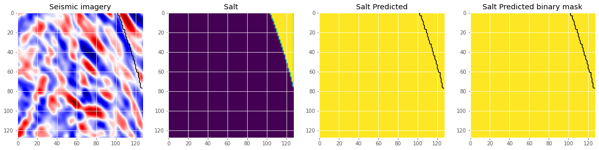
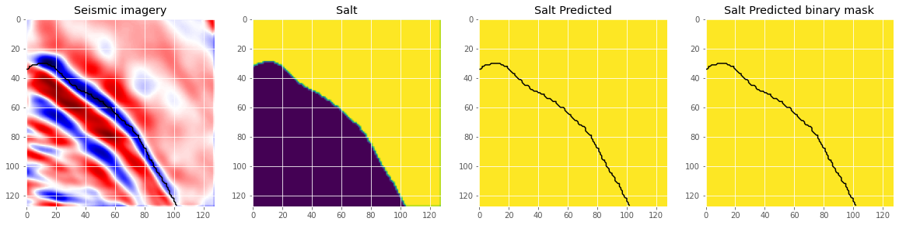
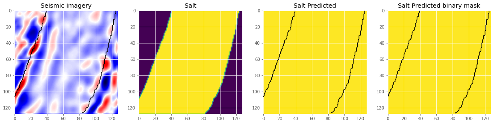

<h1 align="center">UNet architecture for salt segmentation</h1>
<p align="center">
  <a href="#objective">Objective</a> •
  <a href="#technologies">Technologies</a> •
  <a href="#usage">Usage</a> •
</p>
  



  

  <h2 id="objective" > 🎯 Objectives </h2>

  The current work presents convolutional neural networks being used for semantic segmentation of salt bodies on seismic volumes. The salt body could be used to extract seismic horizons or geobodies.

  <h2 id="technologies"> 🛠 Technologies </h2>

  The tools used in the construction of the project were:

  - [Python](https://www.python.org/)
  - [PyTorch](https://pytorch.org/)

  <h2 id="usage" > 👷 Usage </h2>

  - Follow the step-by-step to download and execute the code.
  - Pay attention, `python3` version is 3.10.6 and `pip` version is 22.0.2.

  ```bash
  # Commands used to start the project.
  # Cloning the project
    # Method 1. Using HTTPS
  https://github.com/algocompretto/unet.git
    # Method 2. Using SSH
  git clone git@github.com:algocompretto/unet.git

  # Creating the environment and download the packages
  cd unet/
  python3 -m venv .venv
  
    # Windows - Activating the environment
  .venv\Scripts\activate.bat

    # POSIX - Activating the environment
  source .venv/bin/activate

  pip3 install -r requirements.txt
  ```

And then you are all set! Ready to train and evaluate the model.